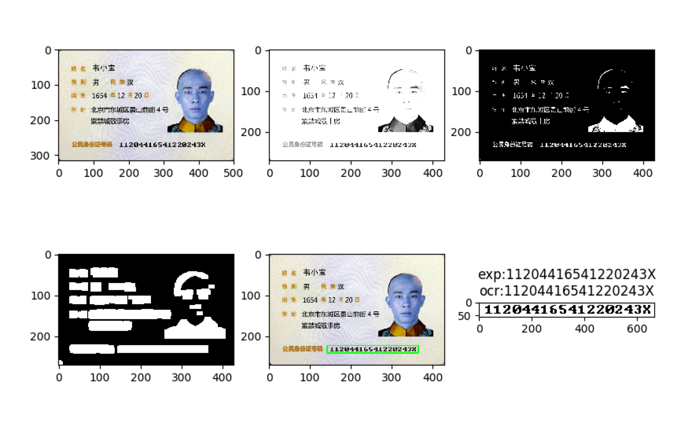

Card-Ocr
==========
身份证识别OCR, 从身份证图片中自动提取身份证号或者其他字段。<br>
测试图片来自百度搜索的样例图片。<br>
找到的图片比较少，目前都能正确识别。<br>
可用的数据集个人很难找到。<br>

# Update for Windows

百度开源了PaddleOcr，识别中文效果很好，编译了一个Windows版本在windows目录。<br>
可以使用CardOcr.exe test0.png 或者CardOcr.py里面的方法调用API。<br>
VisualStudio 2017的源码可以在Source.7z中找到<br>
这种方式加一些逻辑判断可以解析身份证所有字段<br>


12M模型

```

112044165412202438      score: 0.972305<br>
公民身份证号码  score: 0.998278<br>
紫禁城敬事房    score: 0.994911<br>
住址北京市东城区景山前街4号     score: 0.981174<br>
出生1654年12月20日      score: 0.992183<br>
民族汉  score: 0.984364<br>
性别男  score: 0.995585<br>
姓名 韦小宝     score: 0.91293<br>

```

换140M的模型

```
The predicted text is :
公民身份证号码11204416541220243X        score: 0.995691
紫禁城敬事房    score: 0.998352
住址北京市东城区景山前街4号     score: 0.999506
出生1654年12月20日      score: 0.98693
性别男  score: 0.999688
民族汉  score: 0.998341
姓名    score: 0.999685
韦小宝  score: 0.993859
Cost  4.20827s
```
# 依赖
* opencv
* pytesseract
* numpy
* matplotlib

# 流程
* 获取身份证号区域

image-》灰度=》反色=》膨胀=》findContours

* 数字识别

采用tesseract识别，通过trainfont.py获得traineddata.

# trainfont使用

 1. 通过autoBox = 1自动生成box文件
```
trainFont(fontName, fontPath, fontsize, txt, "eng", 0, autoBox=1)
```

 2. 通过jBoxEditor之类的修正box文件
 3. autoBox = 0 生成traineddata
```
 trainFont(fontName, fontPath, fontsize, txt, "eng", 0, autoBox=0)
```

# 识别
 获取到身份证区域之后，截取身份证号，灰度化，然后交给pytesseract
```
 pytesseract.image_to_string(image, lang='ocrb', config=tessdata_dir_config)
```
# Keras
除了用tesseract，也可以用机器学习的方式训练识别。这里用了Keras with Tensorflow，"开头两套双卷积池化层，后面接一个 dropout 防过拟合，再接两个全链接层，最后一个 softmax 输出结果。"
使用genData.py生成train数据。
截取身份证号之后的图片分割成18个图片，x-predict.png
用kerastrain.py进行预测识别
训练的结果有时候3和5能分清，有时候分不清。
因为没有支持CUDA的显卡，用的CPU训练。


# 效果




# TODO
- [ ] Keras with Tesorflow 来训练识别


# 引用
* https://github.com/JinpengLI/deep_ocr/
* http://blog.csdn.net/zhangxb35/article/details/47979939
* https://www.qcloud.com/community/article/606773
* https://github.com/duerig/laser-dewarp/
* http://www.pyimagesearch.com/2017/07/17/credit-card-ocr-with-opencv-and-python/
